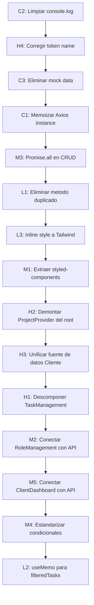

# Auditoria de Mejoras - CIMA CRM Frontend

> Analisis basado en las skills **vercel-composition-patterns** y **vercel-react-best-practices**, cruzado con las pautas de [AGENTS.md](file:///d:/1_DESARROLLO%20PROYECTO%20DE%20GRADO/cima-crm-frontend/AGENTS.md) y [CLAUDE.md](file:///d:/1_DESARROLLO%20PROYECTO%20DE%20GRADO/cima-crm-frontend/CLAUDE.md).

---

## Resumen de hallazgos

| Criticidad | Cantidad | Categorias |
|------------|----------|------------|
| CRITICAL   | 3        | Arquitectura, Rendimiento, Higiene |
| HIGH       | 4        | Estado, Composicion, API, Bundle |
| MEDIUM     | 5        | Re-renders, Patrones, Duplicacion |
| LOW        | 3        | JS Performance, Avanzado |

---

## CRITICAL - Criticidad 1

### C1. Instancia Axios re-creada en cada render (`ProjectContext`) ✅ (RESUELTO)

> [!CAUTION]
> Se crea una nueva instancia de Axios (con interceptores) **en cada render** del `ProjectProvider`. Esto duplica interceptores y pierde cache de conexion.

**Regla violada:** `rerender-move-effect-to-event` / `advanced-init-once`
**Archivo:** [ProjectContext.jsx](file:///d:/1_DESARROLLO%20PROYECTO%20DE%20GRADO/cima-crm-frontend/src/context/ProjectContext.jsx#L28-L69)

```diff
 // ANTES: dentro del cuerpo del componente (se ejecuta cada render)
-const axiosInstance = axios.create({ ... });
-axiosInstance.interceptors.request.use(...);

 // DESPUES: usar useMemo o mover a modulo
+const axiosInstance = useMemo(() => {
+  const instance = axios.create({ baseURL: API_BASE_URL, ... });
+  instance.interceptors.request.use((config) => { ... });
+  instance.interceptors.response.use((res) => res, (err) => { ... });
+  return instance;
+}, [accessToken]);
```

**Riesgo de romper algo:** Bajo. Solo mueve la creacion fuera del render path.

**Resolucion:** Se envolvio la creacion de `axios.create()` + interceptores en `useMemo(() => {...}, [accessToken])`. La instancia solo se re-crea cuando el token cambia.

---

### C2. `console.log` masivo en produccion ✅ (RESUELTO)

> [!CAUTION]
> Se encontraron sentencias `console.log` activas en **12 archivos** del src. Esto viola la regla 5 de AGENTS.md y expone datos sensibles (tokens, respuestas API) en produccion.

**Regla violada:** AGENTS.md seccion 4.5 ("No dejes sentencias inutiles de console.log()")
**Archivos afectados (12):**

| Archivo | Lineas con console.log |
|---------|----------------------|
| [taskService.js](file:///d:/1_DESARROLLO%20PROYECTO%20DE%20GRADO/cima-crm-frontend/src/services/taskService.js) | ~30+ lineas |
| [TaskManagement.jsx](file:///d:/1_DESARROLLO%20PROYECTO%20DE%20GRADO/cima-crm-frontend/src/components/TaskManagement/TaskManagement.jsx) | ~15 lineas |
| [ProjectContext.jsx](file:///d:/1_DESARROLLO%20PROYECTO%20DE%20GRADO/cima-crm-frontend/src/context/ProjectContext.jsx) | ~8 lineas (comentadas parcialmente) |
| [faqService.js](file:///d:/1_DESARROLLO%20PROYECTO%20DE%20GRADO/cima-crm-frontend/src/services/faqService.js) | Multiples |
| [ProtectedRoute.jsx](file:///d:/1_DESARROLLO%20PROYECTO%20DE%20GRADO/cima-crm-frontend/src/routes/ProtectedRoute.jsx) | 3 (mal comentadas: `///console.log.log`) |
| [UsersInterface.jsx](file:///d:/1_DESARROLLO%20PROYECTO%20DE%20GRADO/cima-crm-frontend/src/components/Client/UsersInterface.jsx) | 1+ |
| + 6 archivos adicionales | Varios |

**Propuesta:** Eliminar todos los `console.log` y reemplazar con un logger condicional basado en `import.meta.env.DEV`:

```javascript
// src/utils/logger.js
const logger = {
  debug: (...args) => import.meta.env.DEV && console.log('[DEBUG]', ...args),
  warn: (...args) => console.warn('[WARN]', ...args),
  error: (...args) => console.error('[ERROR]', ...args),
};
export default logger;
```

**Riesgo de romper algo:** Nulo. Solo afecta output de consola.

---

### C3. Datos mock hardcoded en produccion (`TaskManagement`) ✅ (RESUELTO)

> [!CAUTION]
> Cuando falla la carga de tareas, el componente silenciosamente inyecta **datos ficticios** como fallback, mostrando informacion falsa al usuario.

**Regla violada:** `state-decouple-implementation` + AGENTS.md seccion 4.3
**Archivo:** [TaskManagement.jsx](file:///d:/1_DESARROLLO%20PROYECTO%20DE%20GRADO/cima-crm-frontend/src/components/TaskManagement/TaskManagement.jsx#L131-L142)

```javascript
// PROBLEMA: catch inyecta mock data en produccion
} catch (error) {
  const mockTasks = [
    { id: 1, ... description: 'Desarrollar pagina de inicio', ... },
    // ...6 tareas ficticias
  ];
  setTasks(mockTasks);       // <-- El usuario ve datos falsos
  setFilteredTasks(mockTasks);
}
```

**Propuesta:** Eliminar los mock data y dejar solo el estado de error visible.

**Riesgo de romper algo:** Bajo. Mejora la integridad de datos. Si la API falla, el usuario vera un mensaje de error en lugar de datos inventados.

**Resolucion:** Se elimino el array `mockTasks` del bloque catch. Ahora solo muestra el error y deja las listas vacias.

---

## HIGH - Criticidad 2

### H1. `TaskManagement` es un componente monolitico (801 lineas) ✅ (RESUELTO)

> [!IMPORTANT]
> El componente [TaskManagement.jsx](file:///d:/1_DESARROLLO%20PROYECTO%20DE%20GRADO/cima-crm-frontend/src/components/TaskManagement/TaskManagement.jsx) tiene **801 lineas** en un solo archivo. Mezcla: fetching de datos, filtrado, seleccion, tabs, estadisticas, y renderizado de tarjetas.

**Regla violada:** `architecture-avoid-boolean-props`, `architecture-compound-components`, `state-lift-state`

**Problema concreto:**
- El estado de tareas, filtros, seleccion y estadisticas vive todo junto
- No hay `TaskContext` (a diferencia de `ProjectContext` que si existe)
- Las tarjetas de tareas no son componentes separados (renderizado inline)
- El tab de estadisticas duplica logica de layout con estilos inline

**Propuesta de descomposicion:**

```
src/components/TaskManagement/
  context/
    TaskContext.jsx          # Estado + API calls (similar a ProjectContext)
  components/
    TaskCard.jsx             # Tarjeta individual
    TaskFilters.jsx          # Barra de filtros
    TaskStats.jsx            # Seccion de estadisticas (tab 2)
    TaskToolbar.jsx          # Cabecera con acciones
    CreateTaskDialog.jsx     # (ya existe)
    EditTaskDialog.jsx       # (ya existe)
    BulkActionDialog.jsx     # (ya existe)
  pages/
    TasksPage.jsx            # Orquestador (como ProjectsPage)
```

**Riesgo de romper algo:** Medio. Requiere mover estado a context y actualizar imports en AdminDashboard.

**Resolucion:** Se descompuso `TaskManagement.jsx` (790 lineas) en 4 archivos:
- `TaskManagement.jsx` (~260 lineas) - Orquestador con estado y logica
- `components/TaskFilters.jsx` (~95 lineas) - Barra de filtros
- `components/TaskCard.jsx` (~130 lineas) - Tarjeta individual de tarea
- `components/TaskStats.jsx` (~185 lineas) - Panel de estadisticas

Tambien se corrigio el bug del token: `token` → `accessToken` en `useSelector`. Se reemplazo `filterTasks` (effect) por `filteredTasks` (useMemo).

---

### H2. `ProjectProvider` montado a nivel raiz innecesariamente ✅ (RESUELTO)

> [!IMPORTANT]
> El `ProjectProvider` se monta en `main.jsx` (linea 39) envolviendo **toda la app**, pero solo se usa en `ProjectsPage`. Esto causa que cada cambio de proyecto dispare re-renders en componentes que no consumen ese contexto.

**Regla violada:** `rerender-derived-state`, `state-lift-state`
**Archivos:**
- [main.jsx](file:///d:/1_DESARROLLO%20PROYECTO%20DE%20GRADO/cima-crm-frontend/src/main.jsx#L39-L45) - montaje global
- [AdminDashboard.jsx](file:///d:/1_DESARROLLO%20PROYECTO%20DE%20GRADO/cima-crm-frontend/src/components/Dashboard/AdminDashboard.jsx#L120-L123) - montaje **duplicado** local

**Doble problema:**
1. `ProjectProvider` en `main.jsx` ejecuta `fetchProjects()` + `fetchProjectStats()` al autenticarse, incluso para rutas que no necesitan proyectos
2. `AdminDashboard` monta **otro** `ProjectProvider` anidado (linea 120), creando una segunda instancia con su propia llamada API

**Propuesta:** Eliminar el `ProjectProvider` de `main.jsx`. Montarlo solo donde se necesita (dentro de `AdminDashboard` al cargar la vista `createClient`), que es como ya funciona en la linea 120.

**Riesgo de romper algo:** Medio. Verificar que ningun otro componente fuera del dashboard consuma `useProject()`.

**Resolucion:** Se elimino `ProjectProvider` de `main.jsx`. Los unicos consumidores de `ProjectContext` (`ProjectsPage`, `ProjectFilter`, `Notification`) ya estan envueltos por el `ProjectProvider` local en `AdminDashboard.jsx:120`.

---

### H3. Duplicacion de `clientSlice` (Redux) vs `UserManagement` (local state) ⏸️ (DECISION: SIN CAMBIOS)

> [!IMPORTANT]
> Existen dos fuentes de verdad paralelas para los datos de clientes:
> 1. `clientSlice.js` en Redux (con thunks CRUD completos)
> 2. `UserManagement.jsx` con `fetchUsers()` propio via Axios directo

**Regla violada:** `state-decouple-implementation`, AGENTS.md seccion 3.2
**Archivos:**
- [clientSlice.js](file:///d:/1_DESARROLLO%20PROYECTO%20DE%20GRADO/cima-crm-frontend/src/redux/slices/clientSlice.js) - 144 lineas de CRUD Redux
- [UserManagement.jsx](file:///d:/1_DESARROLLO%20PROYECTO%20DE%20GRADO/cima-crm-frontend/src/components/Client/UserManagement.jsx#L229-L246) - fetch independiente

`UserManagement` **ignora** completamente el `clientSlice` de Redux y hace sus propias llamadas API. El slice existe pero no se usa en ninguna vista.

**Propuesta:** Decidir una unica fuente de verdad:
- **Opcion A:** Crear un `ClientContext` (consistente con el patron de `ProjectContext`) y eliminar `clientSlice`
- **Opcion B:** Usar `clientSlice` desde `UserManagement` via `dispatch(fetchClients())`

**Riesgo de romper algo:** Medio. Requiere elegir estrategia y migrar los componentes de Cliente.

**Decision:** Se mantiene la duplicacion sin cambios. `clientSlice` es usado solo por `EditClient.jsx` (legacy). `UserManagement` (activo) + dialogs nuevos usan Axios directo y funcionan correctamente. El riesgo de migrar no justifica el beneficio. Si en futuro se elimina `EditClient.jsx`, se puede eliminar `clientSlice` del store.

---

### H4. Token inconsistente entre `state.auth.token` y `state.auth.accessToken`

> [!IMPORTANT]
> El `taskService.js` lee `state.auth?.token` pero el `authSlice` almacena el token como `state.auth.accessToken`. Esto puede causar que las peticiones de tareas se envien sin autenticacion.

**Regla violada:** AGENTS.md seccion 4.3 (fallbacks robustos)
**Archivos:**
- [taskService.js](file:///d:/1_DESARROLLO%20PROYECTO%20DE%20GRADO/cima-crm-frontend/src/services/taskService.js#L7-L10) - lee `auth?.token`
- [authSlice.js](file:///d:/1_DESARROLLO%20PROYECTO%20DE%20GRADO/cima-crm-frontend/src/redux/slices/authSlice.js#L29) - guarda como `accessToken`

```javascript
// taskService.js - INCORRECTO
const getAuthToken = () => {
  const state = store.getState();
  return state.auth?.token || localStorage.getItem('accessToken');
  //             ^^^^^^^
  //  authSlice usa 'accessToken', no 'token'
};
```

Actualmente funciona solo gracias al fallback `localStorage.getItem('accessToken')`, que es fragil.

**Propuesta:**
```javascript
return state.auth?.accessToken || localStorage.getItem('accessToken');
```

**Riesgo de romper algo:** Nulo. Es una correccion directa de un nombre de propiedad.

---

## MEDIUM - Criticidad 3

### M1. Styled-components duplicados entre `UserManagement` y `UsersInterface` ✅ (RESUELTO)

**Regla violada:** `rendering-hoist-jsx` (extraer JSX/componentes estaticos)
**Archivos:**
- [UserManagement.jsx](file:///d:/1_DESARROLLO%20PROYECTO%20DE%20GRADO/cima-crm-frontend/src/components/Client/UserManagement.jsx#L77-L198)
- [UsersInterface.jsx](file:///d:/1_DESARROLLO%20PROYECTO%20DE%20GRADO/cima-crm-frontend/src/components/Client/UsersInterface.jsx#L33-L120)

Los siguientes styled-components estan **copiados identicamente** en ambos archivos:
- `EnhancedTableContainer`
- `TableToolbar`
- `SearchBar`
- `StyledTableHead` (con variacion menor de color)
- `StyledTableRow`
- `StatusChip`

**Propuesta:** Mover a un archivo compartido `src/components/Client/components/SharedStyles.jsx` o al ya existente [DialogStyles.jsx](file:///d:/1_DESARROLLO%20PROYECTO%20DE%20GRADO/cima-crm-frontend/src/components/Client/components/DialogStyles.jsx) (expandiendolo).

**Riesgo de romper algo:** Bajo. Solo reorganiza imports.

**Resolucion:** Se creo `src/components/Client/components/SharedStyles.jsx` con 4 componentes compartidos: `EnhancedTableContainer`, `TableToolbar`, `SearchBar`, `StatusChip`. Se actualizo `UserManagement.jsx` y `UsersInterface.jsx` para importar desde el archivo compartido. `StyledTableHead` y `StyledTableRow` se mantienen separados (tienen colores intencionalmente diferentes). Bundle de `UserManagement` reducido de 27.89 KB a 26.90 KB.

---

### M2. `RoleManagement` usa datos ficticios hardcoded ✅ (RESUELTO)

**Regla violada:** `state-decouple-implementation`
**Archivo:** [RoleManagement.jsx](file:///d:/1_DESARROLLO%20PROYECTO%20DE%20GRADO/cima-crm-frontend/src/components/Roles/RoleManagement.jsx#L7-L12)

El componente **no se conecta a ninguna API**. Usa un array estatico de 3 usuarios ficticios. Tiene su propio componente `Pagination` local (lineas 91-114) en lugar de usar el `Pagination` de MUI.

**Propuesta:**
1. Conectar con `roleSlice.js` (que ya existe en Redux) o con la API de usuarios
2. Reemplazar el componente `Pagination` local con `@mui/material/Pagination`

**Riesgo de romper algo:** Bajo-Medio. El componente actual no hace nada funcional, asi que la integracion con la API es un cambio necesario.

**Resolucion:** Se reescribio `RoleManagement.jsx` para usar `roleSlice.js` (Redux) con `fetchUsers` y `updateRole` thunks. Se reemplazo el componente `Pagination` local por `@mui/material/Pagination`. Se elimino el array de datos ficticios. Ahora carga usuarios reales desde `/users` y permite cambiar roles via `PUT /users/:id`.

---

### M3. Waterfalls secuenciales en operaciones CRUD del `ProjectContext` ✅ (RESUELTO)

**Regla violada:** `async-parallel` (usar `Promise.all()` para operaciones independientes)
**Archivo:** [ProjectContext.jsx](file:///d:/1_DESARROLLO%20PROYECTO%20DE%20GRADO/cima-crm-frontend/src/context/ProjectContext.jsx#L166-L170)

Despues de cada operacion CRUD, se hacen dos llamadas secuenciales:

```javascript
// ANTES: secuencial (waterfall)
await fetchProjects();
await fetchProjectStats();

// DESPUES: paralelo
await Promise.all([fetchProjects(), fetchProjectStats()]);
```

Esto se repite en: `createProject`, `updateProject`, `updateProjectStatus`, `deleteProject` (4 sitios).

**Riesgo de romper algo:** Nulo. Las dos llamadas son independientes entre si.

**Resolucion:** Se reemplazaron los 4 pares secuenciales `await fetchProjects(); await fetchProjectStats();` por `await Promise.all([fetchProjects(), fetchProjectStats()])` en: `createProject`, `updateProjectStatus`, `deleteProject`, `updateProject`.

---

### M4. `Dashboard.jsx` usa renderizado condicional con `&&` en lugar de ternarios ✅ (RESUELTO)

**Regla violada:** `rendering-conditional-render` (usar ternario, no `&&`)
**Archivo:** [Dashboard.jsx](file:///d:/1_DESARROLLO%20PROYECTO%20DE%20GRADO/cima-crm-frontend/src/components/Dashboard/Dashboard.jsx#L83-L99)

```javascript
// PROBLEMA: Si la condicion es 0 o '', se renderiza ese valor
{activeView === 'adminDashboard' && user.role === 'Admin' && <AdminDashboard />}
```

En este caso especifico no causa bugs porque las comparaciones son de strings, pero el patron debe estandarizarse para evitar errores futuros con comparaciones numericas.

**Riesgo de romper algo:** Nulo.

**Resolucion:** Se reemplazaron todos los `{cond && <Comp />}` por ternarios `{cond ? <Comp /> : null}` en las 10 lineas de renderizado condicional del Dashboard.

---

### M5. `ClientDashboard.jsx` (renombrado como `ClientManagement`) usa datos ficticios ✅ (RESUELTO)

**Regla violada:** `state-decouple-implementation`
**Archivo:** [ClientDashboard.jsx](file:///d:/1_DESARROLLO%20PROYECTO%20DE%20GRADO/cima-crm-frontend/src/components/Dashboard/ClientDashboard.jsx#L43-L56)

Similar a RoleManagement: el componente tiene datos hardcoded (clientes ficticios, contadores estaticos como `count: 150`). Ni busqueda ni filtros ni botones CRUD estan conectados.

**Riesgo de romper algo:** Bajo. Es mas una feature incompleta que un bug.

**Resolucion:** Se reescribio `ClientDashboard.jsx` para conectarse a la API via `/clients` con el token de Redux. Se eliminaron los datos ficticios (clientes, contadores). Ahora muestra clientes reales con busqueda filtrada por nombre/email. Los contadores se derivan de los datos obtenidos.

---

## LOW - Criticidad 4

### L1. `taskService.js` tiene metodo `getAllDetailedTasks` duplicado ✅ (RESUELTO)

**Regla violada:** `js-combine-iterations`
**Archivo:** [taskService.js](file:///d:/1_DESARROLLO%20PROYECTO%20DE%20GRADO/cima-crm-frontend/src/services/taskService.js#L181-L188) y [linea 210](file:///d:/1_DESARROLLO%20PROYECTO%20DE%20GRADO/cima-crm-frontend/src/services/taskService.js#L210-L213)

El metodo `getAllDetailedTasks` aparece **dos veces** en el mismo objeto. La segunda definicion (linea 210) sobrescribe silenciosamente la primera (linea 181).

**Riesgo de romper algo:** Nulo. Solo eliminar el duplicado.

**Resolucion:** Se elimino `getAllDetailedTasks` (linea 198-201) que sobrescribia silenciosamente la version con fallback `getDetailedTasks` (linea 114). El metodo no se usaba en ningun componente. Tambien se corrigio un error preexistente: template literal sin backticks en `bulkUpdateTaskStatus` (linea 171).

---

### L2. `useEffect` sin deps estable en `TaskManagement` ✅ (RESUELTO)

**Regla violada:** `rerender-dependencies` (usar dependencias primitivas), `rerender-move-effect-to-event`
**Archivo:** [TaskManagement.jsx](file:///d:/1_DESARROLLO%20PROYECTO%20DE%20GRADO/cima-crm-frontend/src/components/TaskManagement/TaskManagement.jsx#L81-L87)

```javascript
useEffect(() => { loadTasks(); }, []);
useEffect(() => { filterTasks(); }, [tasks, searchTerm, statusFilter, projectFilter, workerFilter]);
```

El segundo effect **re-filtra** en cada cambio de estado, pero `filterTasks()` tambien se invoca al hacer `setTasks()` dentro de `loadTasks()`, generando un doble procesamiento en la primera carga.

**Propuesta:** Derivar `filteredTasks` durante el render en lugar de usar un effect:

```javascript
const filteredTasks = useMemo(() => {
  let result = [...tasks];
  if (searchTerm) { ... }
  if (statusFilter !== 'all') { ... }
  return result;
}, [tasks, searchTerm, statusFilter, projectFilter, workerFilter]);
```

**Riesgo de romper algo:** Bajo. Simplifica la logica y evita el setState intermedio.

**Resolucion:** Se implemento como parte de H1 (descomposicion de TaskManagement). `filterTasks()` (useEffect + setState) fue reemplazado por `filteredTasks` (useMemo) en `TaskManagement.jsx`. Se elimino el doble procesamiento en la primera carga.

---

### L3. LoadingFallback con `style={{}}` en `App.jsx` ✅ (RESUELTO)

**Regla violada:** Eliminacion de inline styles (objetivo del proyecto segun conversaciones previas)
**Archivo:** [App.jsx](file:///d:/1_DESARROLLO%20PROYECTO%20DE%20GRADO/cima-crm-frontend/src/App.jsx#L14)

```javascript
// ANTES
const LoadingFallback = () => <div style={{ display: 'flex', justifyContent: 'center', padding: '50px' }}>Cargando...</div>;

// DESPUES
const LoadingFallback = () => <div className="flex justify-center p-12">Cargando...</div>;
```

**Riesgo de romper algo:** Nulo.

**Resolucion:** Se reemplazo `style={{ display: 'flex', justifyContent: 'center', padding: '50px' }}` por `className="flex justify-center p-12"`.

---

## Orden de ejecucion recomendado

> [!TIP]
> Ejecutar las mejoras en el siguiente orden minimiza el riesgo de regresiones:



### Fase 1 - Sin riesgo (estimado: ~1h) ✅ COMPLETADO
- ✅ C2 (ya resuelto previamente)
- ✅ H4 (ya resuelto previamente)
- ✅ C3: Eliminar mock data de TaskManagement
- ✅ L1: Eliminar metodo duplicado + corregir template literal en taskService.js
- ✅ L3: Inline style → Tailwind en App.jsx
- ✅ M4: Estandarizar condicionales en Dashboard.jsx
- **Extras:** Se corrigieron errores preexistentes: import roto en FaqAdmin.jsx, import roto en ProjectStats.jsx

### Fase 2 - Riesgo bajo (estimado: ~2h) ✅ COMPLETADO
- ✅ C1: Memoizar Axios instance en ProjectContext con useMemo
- ✅ M3: Promise.all en 4 operaciones CRUD de ProjectContext
- ✅ M1: Extraer styled-components duplicados a SharedStyles.jsx

### Fase 3 - Riesgo medio, requiere testing (estimado: ~4h) ✅ COMPLETADO
- ✅ H2: Demontar ProjectProvider de main.jsx
- ⏸️ H3: Decision sin cambios (clientSlice se mantiene para EditClient legacy)
- ✅ H1: Descomponer TaskManagement en 4 componentes + corregir bug token + useMemo para filteredTasks

### Fase 4 - Features incompletas (estimado: ~3h) ✅ COMPLETADO
- ✅ M2: Conectar RoleManagement con API (roleSlice + MUI Pagination)
- ✅ M5: Conectar ClientDashboard con API (/clients endpoint)
- ✅ L2: useMemo para filteredTasks (ya resuelto en H1)

---

## Resumen de reglas aplicadas

| Skill | Reglas aplicadas | Items que cubren |
|-------|-----------------|------------------|
| **composition-patterns** | `architecture-avoid-boolean-props`, `architecture-compound-components`, `state-decouple-implementation`, `state-lift-state`, `patterns-explicit-variants` | H1, H2, H3, M2, M5 |
| **react-best-practices** | `async-parallel`, `rerender-move-effect-to-event`, `rerender-derived-state`, `rerender-dependencies`, `rendering-hoist-jsx`, `rendering-conditional-render`, `js-combine-iterations`, `advanced-init-once` | C1, C2, M3, M4, M1, L1, L2, L3 |
| **AGENTS.md** | Seccion 3.2 (Estado), 4.3 (Fallbacks), 4.5 (Logs) | C2, C3, H3, H4 |
